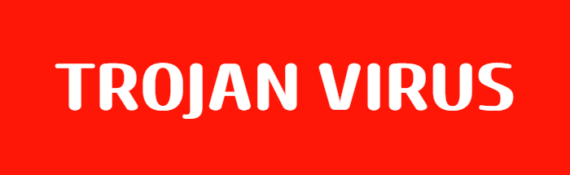
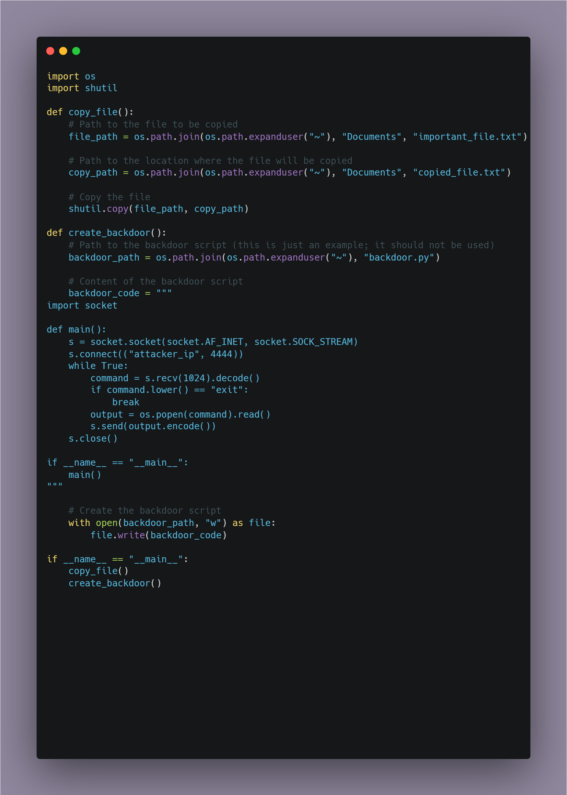

# Understanding Viruses: How They Work and How to Protect Yourself

## What is a Trojan Virus?

A Trojan virus, often simply referred to as a "Trojan," is a type of malicious software that disguises itself as legitimate software to gain unauthorized access to a system. Unlike viruses or worms, Trojans do not replicate themselves. Instead, they rely on deception to trick users into executing them.

### Common Infection Vectors

Trojans can infect systems through various means, including:

- **Downloads:** They can be bundled with seemingly harmless files or software from untrustworthy sources.
- **Game Mods:** Custom modifications for games may include Trojans if downloaded from unofficial or shady sites.
- **Websites:** Malicious links or compromised websites can prompt users to download and execute Trojans.

### Detection and Removal

Most antivirus programs are designed to detect and remove Trojans. However, their effectiveness can vary:

- **Windows Defender:** This is a basic antivirus tool that comes pre-installed with Windows. While it provides some level of protection, it may not always be sufficient.
- **Third-Party Antivirus Software:** Tools like **Total AV** offer more comprehensive protection and are recommended for better security.

### Are You Safe from Viruses?

<ins>**Short Answer:** **\NO/**</ins> — No system is completely immune to viruses. However, you can enhance your protection by:

- Sticking with <ins>**Windows Default**</ins> antivirus or
- Using reputable third-party software like <ins>**Total AV**</ins>.

### Note on Example Code

The information provided here is meant for educational purposes only. It is important to use security knowledge responsibly and ensure that you follow best practices for system protection.

